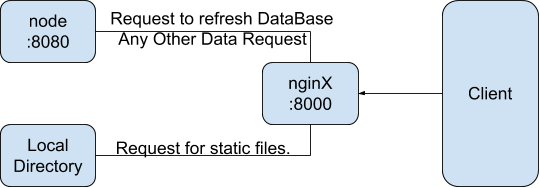

# MediaClientApp

A flutter based app that acts as Client to a nginx media server.

## Tech Stack Used

* [Flutter](https://flutter.dev/) - Flutter is an open-source UI software development kit created by Google.

## What does it intend to do?

* Retrieve the data prepared by the node server about the Host Server's movie files.
* Serve as a frontend that provides info about the respective movies from the omDb API.
* Offer basic searching facilities and an option to play the movie on a third party video player.

## Basic Connection Layout
 
## Demo Gif

* Movie List View

* Movie Detail View

* Search Option

* Video Playback using MXPlayer

* App Restart 

Remembers previous state

